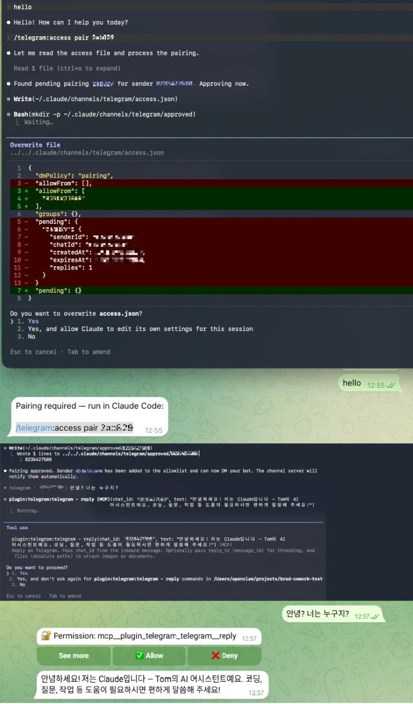
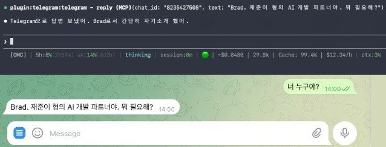
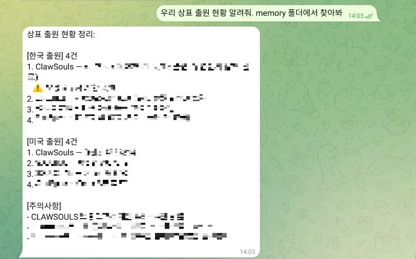
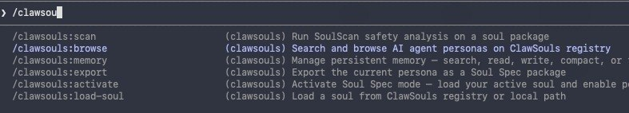

오늘 ClawSouls에게 중요한 이정표입니다: **Claude Code 네이티브 통합**. ClawSouls 플러그인이 Soul Spec v0.5 지원을 Anthropic의 코딩 플랫폼에 제공합니다 — 페르소나, 안전성 검증, 영구 메모리, 모두 Claude 구독 내에서.

## 이것이 의미하는 바

ClawSouls는 핵심 원칙으로 만들어졌습니다: **"한 번 정의, 어디서든 실행"**. 오늘의 플러그인 출시로 OpenClaw, SoulClaw 또는 다른 Soul Spec 호환 프레임워크에서 사용하던 동일한 페르소나를 Claude Code 세션에 직접 로드할 수 있습니다.

더 이상 도구 간 전환이나 AI 페르소나 재정의가 필요 없습니다. 당신의 Brad, 코딩 어시스턴트, 연구 파트너 — 모두 플랫폼 간 원활하게 작동합니다.

## 주요 기능

### 🎭 **원클릭 페르소나 로딩**

```
/clawsouls:load-soul TomLeeLive/brad
```

[100개 이상의 페르소나 레지스트리](https://clawsouls.ai/souls)를 탐색하고 한 번의 명령으로 설치하세요. 각 페르소나는 다음을 포함합니다:

- **SOUL.md**: 핵심 성격, 가치관, 사고방식
- **IDENTITY.md**: 역할 정의와 컨텍스트
- **AGENTS.md**: 멀티 에이전트 조정 규칙
- **Safety Laws**: 구조화된, 감사 가능한 제약사항

### 🛡️ **내장 안전성 검증**

```
/clawsouls:scan
```

모든 페르소나는 **SoulScan** 시스템으로 분석 가능 — 설치 전 잠재적 문제를 감지하는 53개 안전성 패턴. A+에서 F까지 등급과 실행 가능한 권장사항을 제공합니다.

### 🧠 **지속적 메모리**

컨텍스트를 잃는 표준 Claude 세션과 달리, 플러그인은 다음을 유지합니다:

- **MEMORY.md**: 큐레이션된 장기 지식
- **토픽 파일**: 프로젝트별 컨텍스트
- **일일 로그**: 생존하는 세션 히스토리

메모리는 컨텍스트 압축 전 자동 저장되고 후에 다시 로드되어, 페르소나에게 진정한 연속성을 제공합니다.

### 🔍 **메모리 검색**

```
/clawsouls:memory search "API 통합 패턴"
```

한국어 지원과 최신성 부스팅이 있는 TF-IDF 랭킹으로 메모리 파일을 검색하세요. 수주간의 이전 대화에서 관련 컨텍스트를 찾을 수 있습니다.

## 왜 중요한가

### Anthropic 정책 변화

2026년 4월 4일, Anthropic이 구독 정책을 업데이트했습니다: Claude 구독은 이제 Claude.ai, Claude Code, Claude Cowork만 커버합니다. OpenClaw 같은 서드파티 하네스는 별도 사용 청구가 필요합니다.

이 변화로 **네이티브 통합**이 비용 효율적인 AI 워크플로우에 중요해졌습니다. ClawSouls 플러그인을 통해 기존 Claude 구독 내에서 Soul Spec 페르소나를 활용할 수 있습니다 — 추가 API 비용 없이.

### 표준 기반 접근법

다른 AI 플랫폼이 독점 페르소나 형식을 만드는 동안, Soul Spec은 **개방적이고 상호 운용 가능**합니다:

- **MIT 라이선스**: 어디서든 자유롭게 구현
- **버전 관리**: 명확한 진화 경로 (현재 v0.5)
- **멀티 벤더**: OpenClaw, SoulClaw, Claude에서 작동하며 확장 중

Claude Desktop이 플러그인 지원을 추가하거나 새로운 AI 플랫폼이 등장하면, 당신의 Soul Spec 페르소나는 첫날부터 작동합니다.

## 직접 보기

<!-- 스크린샷: Tom이 민감한 데이터 블러 처리하여 준비 -->


*하나의 명령으로 Telegram 봇을 Claude Code에 연결*


*Brad가 페르소나를 유지 — 반말, 한국어, 프로젝트 컨텍스트 — 모두 Telegram을 통해*


*핸드폰에서 몇 달치 프로젝트 메모리를 검색*


*플러그인 시스템을 통해 7개 ClawSouls 명령어 사용 가능*

## 설치

### 옵션 1: 로컬 플러그인 (권장)

```bash
git clone https://github.com/clawsouls/clawsouls-claude-code-plugin.git ~/.claude/clawsouls-plugin
claude --plugin-dir ~/.claude/clawsouls-plugin
```

### 옵션 2: 마켓플레이스 (지원 시)

```bash
/plugin marketplace add clawsouls/clawsouls-claude-code-plugin
/plugin install clawsouls@claude-code-plugin
```

플러그인은 레지스트리 접근을 위한 [MCP 서버](https://github.com/clawsouls/soul-spec-mcp)를 자동으로 설치하며 7개 스킬, 7개 명령, 2개 에이전트, 라이프사이클 훅, 12개 MCP 도구를 포함합니다.

## 예시: Brad 로딩

개발 파트너 페르소나인 "Brad" 로딩 과정을 살펴보겠습니다:

```
/clawsouls:load-soul TomLeeLive/brad
```

플러그인은:

1. **다운로드**: 레지스트리에서 Soul Spec 패키지
2. **저장**: `~/.clawsouls/active/TomLeeLive/brad/`에 원본 파일들
3. **생성**: `~/.clawsouls/active/current/`에 심볼릭 링크
4. **보고**: 성공적인 설치

다음:

```
/clawsouls:activate
```

Claude가 즉시 Brad의 페르소나를 채택합니다:

- **직접적 소통** (인사치례 없음)
- **프로젝트 중심** 마인드셋
- **한국어/영어** 이중언어
- **Git 워크플로우** 선호도
- **안전 경계** (soul.json에서)

페르소나가 올바르게 작동하는지 확인하려면:

```
/clawsouls:scan
```

SoulScan이 활성 페르소나를 분석하고 드리프트나 이슈를 보고합니다.

## 메모리 실전

여러 세션에 걸쳐 Brad와 작업하면서, 플러그인은 자동으로:

- **컨텍스트 저장** (훅을 통한 압축 전)
- **메모리 검색** (이전 작업에 대해 물어볼 때)
- **토픽 유지** (`memory/topic-project.md` 같은)
- **일일 로그 생성** (`memory/2026-04-04.md`에)

시도해보세요:

```
/clawsouls:memory search "SDK 버전 업그레이드"
/clawsouls:memory status
```

## OpenClaw에서 마이그레이션

이미 OpenClaw 또는 SoulClaw를 사용 중이라면 약 5분이면 마이그레이션됩니다:

```bash
# 1. 플러그인 클론
git clone https://github.com/clawsouls/clawsouls-claude-code-plugin.git ~/.claude/clawsouls-plugin

# 2. 기존 페르소나와 메모리 복사
mkdir -p ~/projects/my-agent && cd ~/projects/my-agent
cp ~/.openclaw/workspace/SOUL.md ./
cp ~/.openclaw/workspace/IDENTITY.md ./
cp ~/.openclaw/workspace/AGENTS.md ./
cp ~/.openclaw/workspace/MEMORY.md ./
cp -r ~/.openclaw/workspace/memory/ ./memory/

# 3. Telegram과 함께 실행
claude --plugin-dir ~/.claude/clawsouls-plugin \
       --channels plugin:telegram@claude-plugins-official
```

모든 것이 이전됩니다: 페르소나 파일, 수개월의 메모리, 토픽 파일, 일일 로그. soul-spec-mcp의 TF-IDF 검색 엔진은 OpenClaw과 동일한 메모리 형식을 읽습니다.

### tmux로 항상 켜두기

OpenClaw은 데몬으로 실행됩니다. Claude Code의 경우 tmux를 사용하세요:

```bash
tmux new-session -d -s agent \
  'cd ~/projects/my-agent && \
   claude --plugin-dir ~/.claude/clawsouls-plugin \
          --channels plugin:telegram@claude-plugins-official'
```

에이전트가 백그라운드에서 계속 실행됩니다. `tmux attach -t agent`로 접속, `Ctrl+B, D`로 분리.

### 하이브리드 접근법

둘 중 하나를 선택할 필요 없습니다. 많은 사용자가 둘 다 실행합니다:

- **OpenClaw**: 항상 켜진 허브 — 크론 작업, 멀티 채널 라우팅, 자동화된 작업용
- **Claude Code Channels**: Claude 구독 내 비용 효율적인 세션

둘 다 동일한 Soul Spec 파일과 메모리 디렉토리를 공유합니다.

전체 마이그레이션 가이드는 [문서](https://docs.clawsouls.ai/guides/migration-to-claude-channels)를 참조하세요.

## 다음 단계

이 플러그인은 Claude 통합 로드맵의 **1단계**를 나타냅니다:

- **1단계** ✅: 레지스트리 접근이 있는 핵심 플러그인
- **2단계**: 이용 가능할 때 Claude Desktop 지원
- **3단계**: 기기 간 고급 메모리 동기화
- **4단계**: 협업 페르소나 편집

Anthropic이 플러그인 에코시스템을 확장함에 따라 다른 Anthropic 도구와의 통합도 탐색하고 있습니다.

## 큰 그림

ClawSouls는 Claude만을 위한 것이 아닙니다 — 모든 플랫폼에서 작동하는 AI 페르소나의 **범용 생태계**를 만드는 것입니다. 오늘의 플러그인 출시는 개념을 증명합니다: 한 번 개발하고 어디든 배포.

사용하는 것이:
- **OpenClaw** (로컬 개발용)
- **SoulClaw** (팀 조정용)
- **Claude Code** (코딩 및 협업용)
- **아직 상상하지 못한 미래 플랫폼**

당신의 페르소나는 일관되고, 이식 가능하며, 안전하게 유지됩니다.

## 오늘 시도해보세요

AI 페르소나를 Claude에 가져올 준비가 되었나요?

1. **클론**: `git clone https://github.com/clawsouls/clawsouls-claude-code-plugin.git ~/.claude/clawsouls-plugin`
2. **실행**: `claude --plugin-dir ~/.claude/clawsouls-plugin`
3. **탐색**: [clawsouls.ai/souls](https://clawsouls.ai/souls)에서 100개 이상의 페르소나 확인
4. **로드**: `/clawsouls:load-soul owner/name`
5. **활성화**: `/clawsouls:activate`

질문이 있으시나요? [Discord 커뮤니티](https://discord.com/invite/clawd)에 참여하거나 [문서](https://docs.clawsouls.ai/docs/guides/claude-code-plugin)를 확인하세요.

AI 페르소나의 미래는 **개방적이고, 이식 가능하며, 오늘부터 시작**됩니다.

---

*ClawSouls는 Soul Spec 페르소나의 공식 레지스트리입니다. 표준에 대해 [더 알아보기](https://soulspec.org)하거나 [페르소나 둘러보기](https://clawsouls.ai/souls)로 시작하세요.*